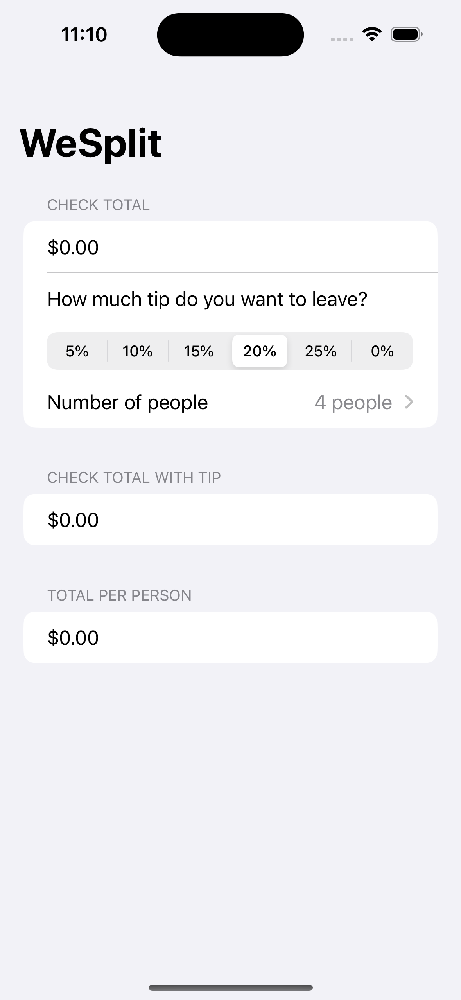
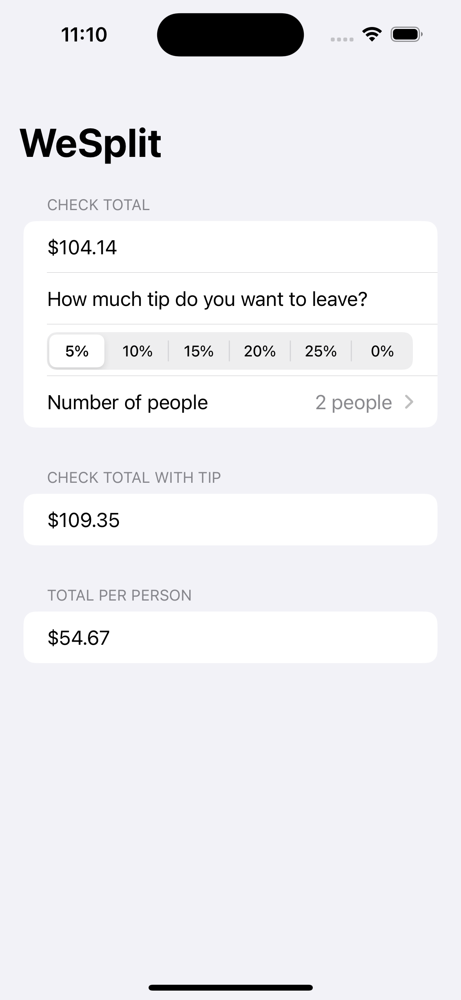
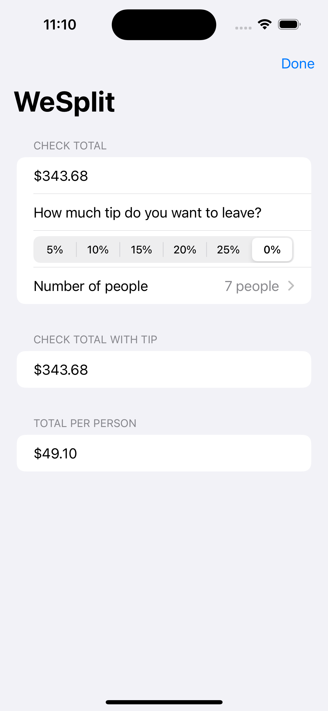

# WeSplit

WeSplit is a practical iOS app built using SwiftUI, designed to help users easily split bills among friends or colleagues. It calculates the amount each person owes based on the total bill, selected tip percentage, and the number of people sharing the expense.

    
    
    

## Features

- **Bill Splitting**: Easily divide the total bill amount by the number of people.
- **Tip Calculation**: Select how much tip to leave, with the app calculating the tip amount and adding it to the total.
- **Per Person Total**: Displays the amount each person needs to pay, including their share of the tip.

## How to Use

1. Launch the app.
2. Enter the total bill amount.
3. Choose the tip percentage you wish to leave.
4. Select the number of people splitting the bill.
5. View the calculated total per person and the total bill with the tip included.

## Getting Started

To run this project locally:

- Ensure you have Xcode installed on your Mac.
- Clone this repository to your machine.
- Open the project in Xcode.
- Build and run the project on an iOS simulator or a physical device.

## Credits

This project is part of the ["100 Days of SwiftUI"](https://www.hackingwithswift.com/100/swiftui) course by Paul Hudson. I learned how to build this game and further develop my SwiftUI skills through the course.

## Learning Experience

Developing WeSplit enhanced my understanding of SwiftUI and its integration with the Swift programming language, allowing me to gain hands-on experience in building and testing iOS applications. In addition to following the main project instructions, I completed extra challenges provided at the end of the course where there were no instructions.
